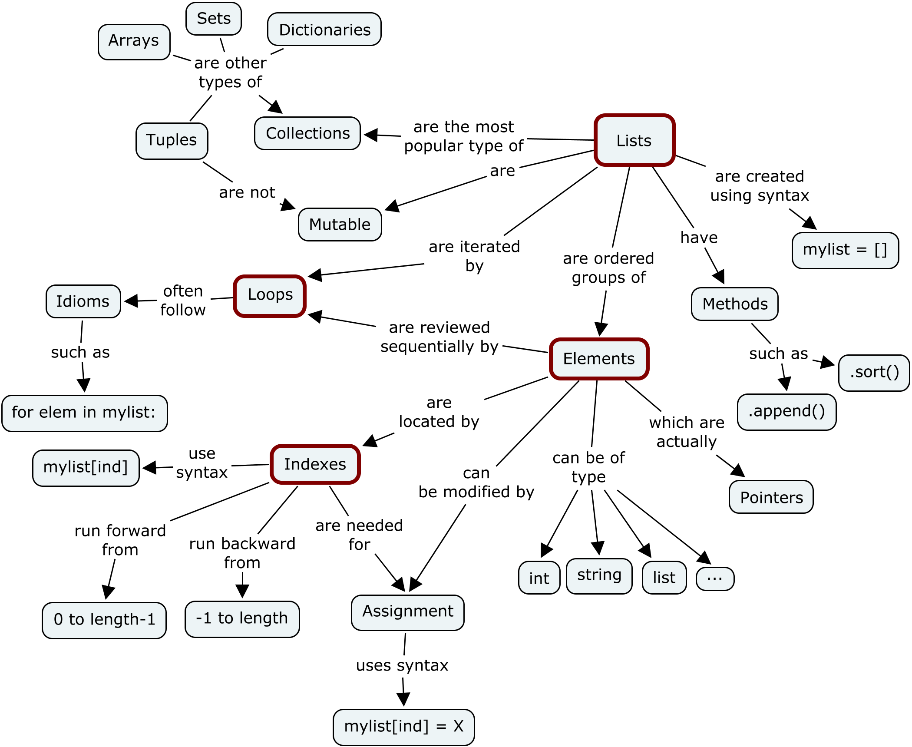

# __python__

## __data structure 数据结构__

### __数据类型关系__

上面是python 内置数据类型的关系图（图片可以编码成base64，可这样做的好处是什么？），颇有些像路透社的那张图。

数据类型按照几个维度可以分类

1. 可修改和不可修改
   
    [介绍](https://www.geeksforgeeks.org/mutable-vs-immutable-objects-in-python/)

    immutable object 函数传递时是值传递
    mutable object 函数传递时是指针传递

    mutable : dict list 
    inmutable : tuple int string float

2. 
